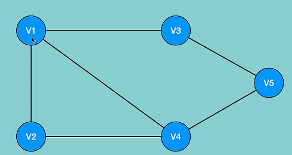
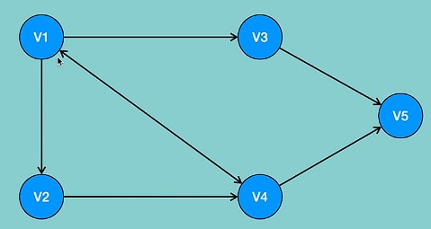
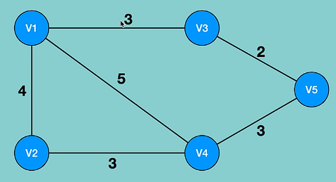
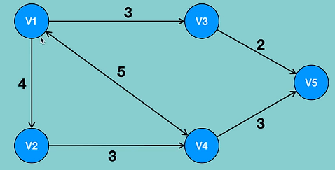
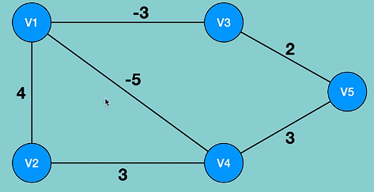
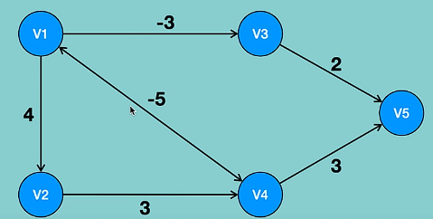

# Graphs
### What are graphs?
- Graph consists of a finite set of vertices(or nodes) and a set of edges which connect a pair of nodes

### Why use graphs?
- Identify shortest paths in network or routes

### Graph terminology
- Vertex: vertices are the nodes of the graph
- Edge: teh edge is the line that connects pairs of vertices
- Unweighted graph: a graph which does not have a weight associated with any edge
- Weighted graph: a graph which has a weight associated with any edge
- Undirected graph: in case the edges of the graph do not have a direction associated with them
- Directed graph: if the edges in a graph have a direction associated with them
- Cyclic graph: a graph which has at least one loop
- Acyclis graph: a graph with no loop
- Tree: it is a special case of directed acyclic graphs

### Types of graphs
- Directed
    - Weighted
        - Positive
        - Negative
    - Unweighted
- Undirected
    - Weighted
        - Positive
        - Negative
    - Unweighted

