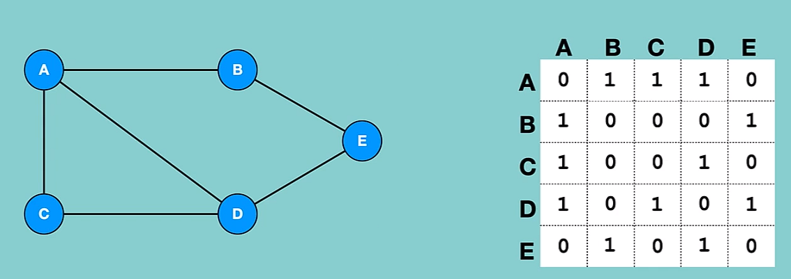
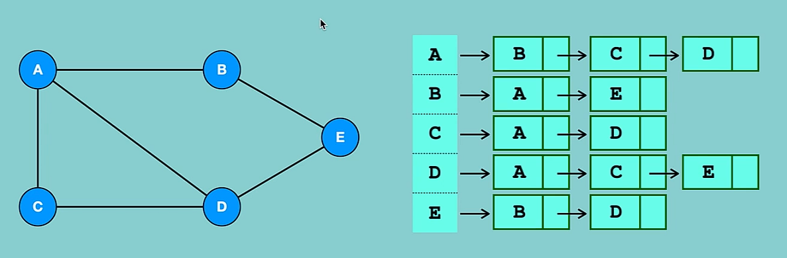
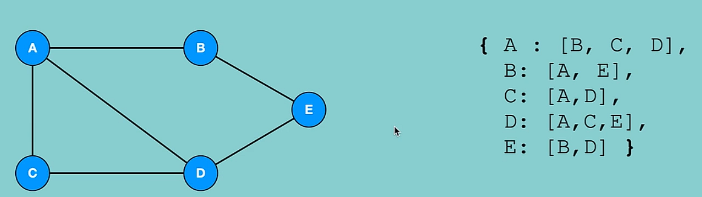

# Graphs
### What are graphs?
- Graph consists of a finite set of vertices(or nodes) and a set of edges which connect a pair of nodes

### Why use graphs?
- Identify shortest paths in network or routes

### Graph terminology
- Vertex: vertices are the nodes of the graph
- Edge: teh edge is the line that connects pairs of vertices
- Unweighted graph: a graph which does not have a weight associated with any edge
- Weighted graph: a graph which has a weight associated with any edge
- Undirected graph: in case the edges of the graph do not have a direction associated with them
- Directed graph: if the edges in a graph have a direction associated with them
- Cyclic graph: a graph which has at least one loop
- Acyclis graph: a graph with no loop
- Tree: it is a special case of directed acyclic graphs

### Types of graphs
- Directed
    - Weighted
        - Positive
        - Negative
    - Unweighted
- Undirected
    - Weighted
        - Positive
        - Negative
    - Unweighted

Unweighted - undirected

Unweighted - directed

Positive - weighted - undirected

Positive - weighted - directed

Negative - weighted - undirected

Negative - weighted - directed

# Graph representation
- Adjacency matrix: an adjancy matrix is a square matrix or a 2D array. And the elements of the matrix indicate whether pairs of verices are adjacent or not in the graph

- Adjacency list: an adjacency list is a collection of unordered list used to represent a graph. Each list describes the set of neighbors of a vertex in the graph.

If a graph is complete or almost complete we should use adjacency matrix. If the number of edges are few then we should use adjacency list.

# Graphs in python

Python dictionary implementation:

# Graph traversal

Breadth first search (BFS):
- Look at the dictionary structure. Start at vertex, go through all of its edges in order. If you have already visited an edge, move to the next one.

Time complexity: O(V+E)

Space complexity: O(V)