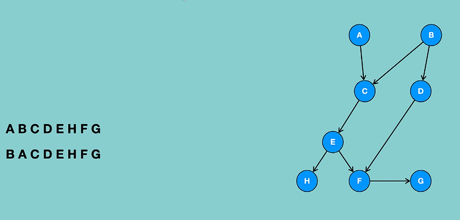

# Topological sort
Sorts given actions in such a way that if there is a dependency of one action on another, then hte dependent action always comes later than its parent action.

Time complexity: O(V+E)

Space complexity: O(V+E)